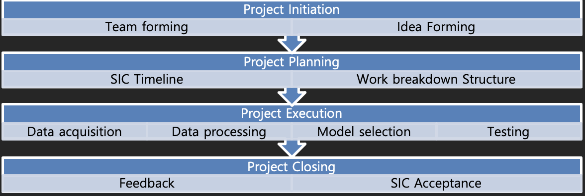
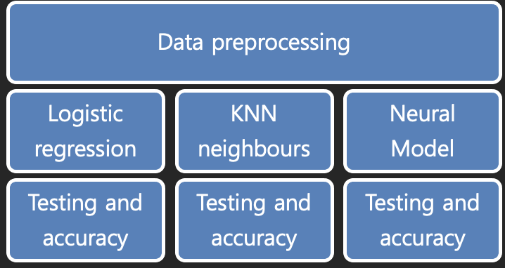

<h2 align="center">Hi 👋, I'm Salama Almansoori</h2>
<h3 align="center">Dev/student at 42abudhabi</h3>

- 👨‍💻 All of my projects are available at [https://github.com/s-almanso](https://github.com/s-almanso)

- 📫 How to reach me **salmanso@student.42abudhabi.ae**


## Rain Prediction - SIC AI Project

```
An AI capstone project is to be completed for fulfillment
of the AI course conducted by Samsung Innovation Campus.
The project should neither be too difficult nor too easy
and should be able to complete within 2 weeks. The team was
formed as a result of mutual cooperation during the course
although 1 member had to quit the course due to personal
reasons. At present the team consists of 2 members.
```
---
#### Motivation:
The team set out to seek AI projects with high impact and real life sustainable applications. We came across the UAE Research Program for Rain Enhancement Science with a prize money of 1.5 Million USD. Although we cannot directly participate in this program, we were really interested and decided to pursue rain prediction and enhancement as our AI capstone project.

---

#### Objectives:
Our objective was to create an AI algorithm that can take in the different weather data and predict for rain the next day. We consider this as a first wherein later we can enable detection of moisture-laden clouds and deploy resources to artificially induce rainfall. We believe we could contribute to water security locally and eventually even globally by guiding rain to fall over land instead of the oceans.

---

## Project Excution

### Data Acquisition

At first publicly available UAE weather data from https://addata.gov.ae and https://bayanat.ae were considered. But only monthly weather data was available, which was insufficient for AI training and testing. To access large datasets, we decided to pursue public data from Australia’s Bureau of Meteorology and acquired 10 years of daily weather data for 49 geographical locations.

### Training Methodology

To demonstrate the AI learning, we considered the Keras sequential model API. We will add Deep learning layers with the Rectified Linear Unit (ReLU) activation function. Because there are just two classes, the loss function will be Binary Cross entropy and we will use the Adam Gradient descent algorithm to optimize. We'll plot training and validation loss over epochs and adjust hyper parameters as needed. Finally, we will evaluate the confusion matrix and accuracy by testing on the test set. To compare to other learning methods we decided to demonstrate 2 other algorithm: Linear Regression and KNN algorithm and compare their individual accuracy.

### Workflow


### Sytem Diagram


---

## Installation
Follow the steps below to succusefully run the program:

Download the dataset from <a href='https://www.kaggle.com/jsphyg/weather-dataset-rattle-package'>kaggle</a>

Clone this repository to your local machine:
```
git clone https://github.com/s-almanso/Rain_Prediction_AI_SIC
```
After cloning go to the project folder and then copy the data file you downloaded from kaggle into the folder.

In order to view the project you need to download <a href='https://jupyter.org/install'>jupyter notebook</a>.

<b>Note:</b> depending on your PC specs it might take a while to run the program especially the KNN part.

---


<h3 align="left">Connect with me:</h3>
<p align="left">
<a href="https://twitter.com/_thesalama" target="blank"></a>
<a href="https://instagram.com/batsaam_" target="blank"></a>
</p>

<h3 align="left">Languages and Tools:</h3>
<p align="left"> <a href="https://www.arduino.cc/" target="_blank" rel="noreferrer">  </a> <a href="https://www.cprogramming.com/" target="_blank" rel="noreferrer">  </a> <a href="https://www.docker.com/" target="_blank" rel="noreferrer">  </a> <a href="https://git-scm.com/" target="_blank" rel="noreferrer">  </a> <a href="https://www.linux.org/" target="_blank" rel="noreferrer">  </a> <a href="https://www.mathworks.com/" target="_blank" rel="noreferrer">  </a> <a href="https://pandas.pydata.org/" target="_blank" rel="noreferrer">  </a> <a href="https://www.python.org" target="_blank" rel="noreferrer">  </a> <a href="https://pytorch.org/" target="_blank" rel="noreferrer">  </a> <a href="https://scikit-learn.org/" target="_blank" rel="noreferrer">  </a> <a href="https://seaborn.pydata.org/" target="_blank" rel="noreferrer">  </a> <a href="https://www.tensorflow.org" target="_blank" rel="noreferrer">  </a> </p>

